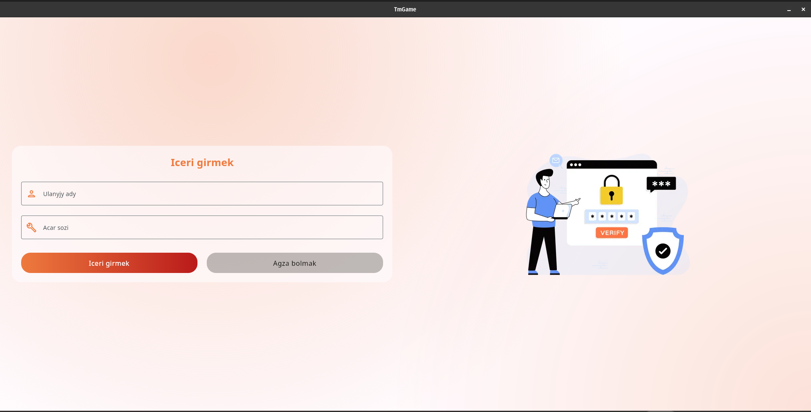
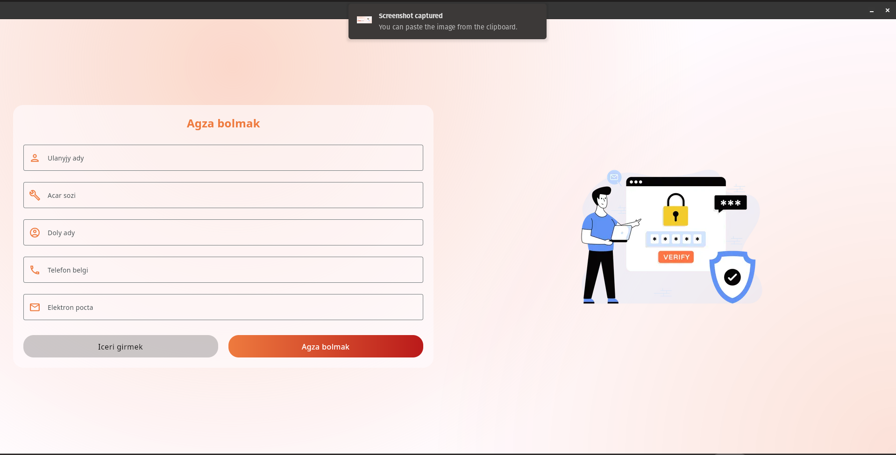
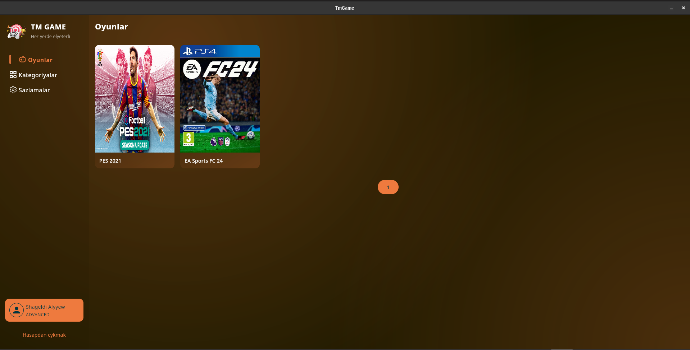
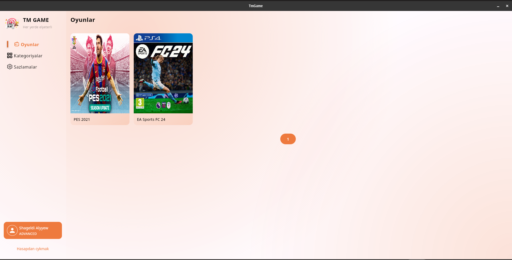
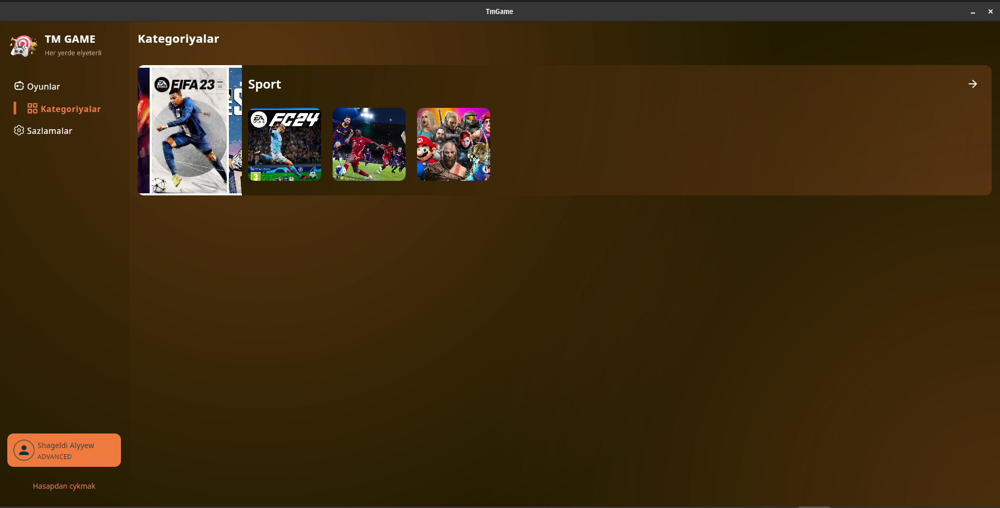
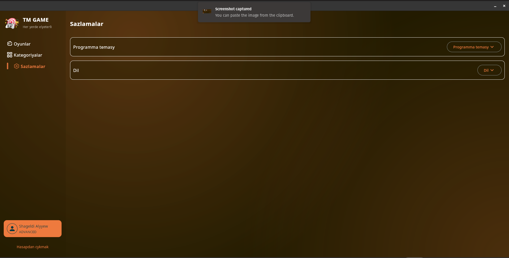

# Compose Multiplatform Desktop (Windows, Linux, Mac-OS) Application

### Desktop
Run the desktop application: `./gradlew :composeApp:run`

#### Login Page

#### Create account page

#### Games page dark

#### Games page light

#### Games details dark

#### Games details light

#### Categories page

#### Settings page
